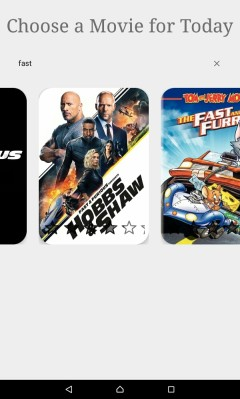

# Movie Android Application

It shows popular movies and allow the user to search for specific movie, also shows Movie details.

## Overview
* The application has two Activities.
* First Activity has Textview , Searchview ,and RecyclerView.
* The RecyclerView displays popular Movies or if we search it displays search results.
* Second Activity display Movie details the user clicked on it 

## Technologies
* REST API with help of Retrofit library.
* MVVM Architecture.
* Java as development programming language.
* Android Studio as development environment.